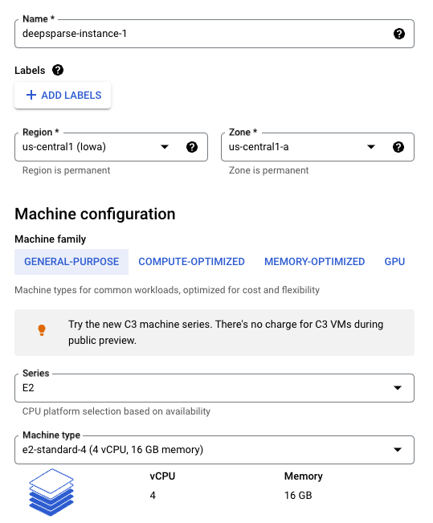
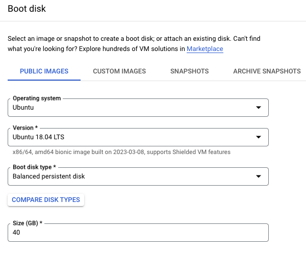
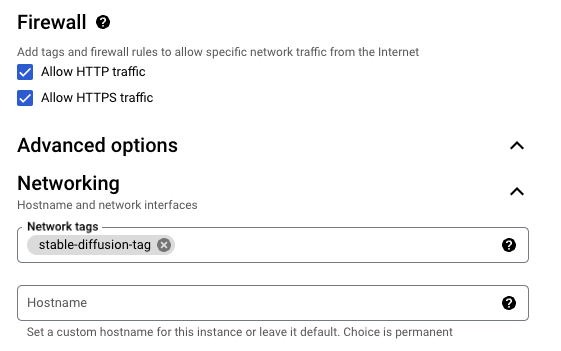
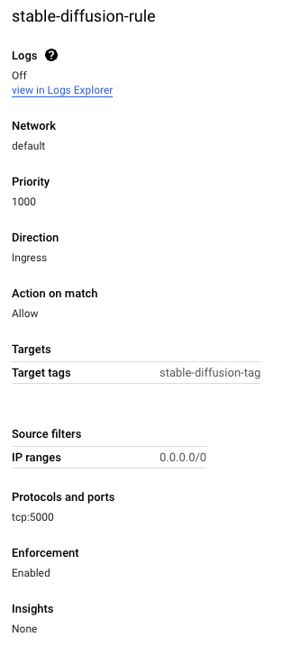
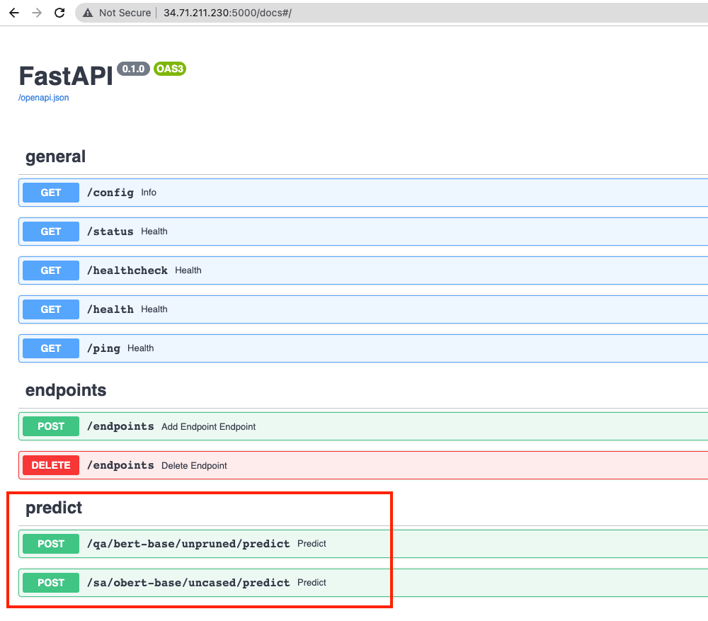

# Deploying and Running BERT on GCP (vCPU only) VMs
This is a reference for deploying and running inference using [Google's BERT](https://en.wikipedia.org/wiki/BERT_(language_model)) ML model. This includes running a Uvicorn server and Fast API, so you can expose inference endpoints publicly, if you want to. 

When done, you'll be able to use this to run predictions like:
1. Question and Answer (qa): Give the model a context (like a sentence or a paraghaph) and ask it questions about it. For example, use it to summarize a news story.
2. Sentiment Analysis (sa): Give the model a context (like a sentence or a paragraph) and ask it to guess the sentiment (positive or negative). For example "Russia invaded Ukraine" should be "negative".
3. Zero-shot Classificaton (zs): Give the model a context (like a sentence or a paraghraph) and a few labels (like "education", "business", "politics", "entertainment") and it will predict the most likely tone.
4. And more...

This is what it will make use of:
1. Deepsparse: https://github.com/neuralmagic/deepsparse -- Open source software from Neural Magic, Inc. that is "A sparsity-aware inference runtime that delivers GPU-class performance on commodity CPUs, purely in software, anywhere."
2. Uvicorn Server
3. Fast API
4. Models and Datasets from: https://huggingface.co/neuralmagic

Here is what the final result will look like:


## Prerequisites

1. Access to a GCP account and GPU instances (may need to request this manually if they are not available by default)
2. SSH configured so you can access your Google VM from the command line
3. VSCode with the [SSH Remote Host Extension](https://code.visualstudio.com/docs/remote/ssh) (if you prefer to edit files in an editor, over vi/ vim in GCP CLI).


## Steps

Here is the summary:

1. Setup your GCP (vCPU only) VM instance
2. Install conda (and use it to create a python 3.10 venv)
3. Install Deepsparse & Deepsparse Server
4. Run Deepsparse server exposing a swagger endpoint
5. Run Inference

### Setting up your GCP VM Instance

#### Machine Type
You can pick any x86 VM with at least 2 cores and at least 8GB of RAM. Here is what I went with
    <p align="center">
        
    </p>

#### Boot Image
Any linux variant that you are most comfortable should be fine, as long as you can install python and pip on it. Here is what I went with:
    <p align="center">
        
    </p>

#### Networking
I did 2 things (these are only important if you want to be able to enable API access externally - which I planned to do):
1. Enabled HTTP and HTTPS traffic
    <p align="center">
        
    </p>
2. Setup a firewall rule to allow all external IPs and opened tcp port 5000
    <p align="center">
        
    </p>

### Installing Software

1. I installed Conda so that I can use it to manage my Python Virtual Environments
   ```
   wget https://repo.anaconda.com/miniconda/Miniconda3-py310_23.1.0-1-Linux-x86_64.sh
   ```
   NOTE: you'll need to reinitatilize the SSH session, before you can use conda

2. Setup Python 3.10 Virtual Env
   ```
   conda create -n python310 python=3.10
   conda activate python310
   ```
3. Check/ confirm python and pip versions
   ```

   ```
4. Install deepsparse and deepsparse server
   ```
    pip install deepsparse
    pip install deepsparse[server]
   ```
5. Set up config file that specifies which models you want to include in the server at run time (I only inluded two - one BERT model for question & answer and one OBERT model for sentiment analysis)
   ```
   touch config.yaml

   #copy this into the file
   num_cores: 2
   num_workers: 2
   endpoints:
       - task: question_answering
         route: /qa/bert-base/unpruned/predict
         model: zoo:nlp/question_answering/bert-base/pytorch/huggingface/squad/base-none
         batch_size: 1
       - task: sentiment_analysis
         route: /sa/obert-base/uncased/predict
         model: zoo:nlp/sentiment_analysis/obert-base/pytorch/huggingface/sst2/pruned90_quant-none
         batch_size: 1
   ```
6. Run deepsparse server with config file, desired host (give it the internal IP of the GCP host, if you want to expose extenally) and port (i used 5000)
   ```
   deepsparse.server  config config.yaml --host "10.128.0.13" --port "5000"

   #output should end in something like this
  
   2023-04-01 01:24:19 deepsparse.server.server INFO     Adding endpoints for 'sentiment_analysis-0'
   INFO:deepsparse.server.server:Adding endpoints for 'sentiment_analysis-0'
   2023-04-01 01:24:19 deepsparse.server.server INFO     Added '/sa/obert-base/uncased/predict' endpoint
   INFO:deepsparse.server.server:Added '/sa/obert-base/uncased/predict' endpoint
   2023-04-01 01:24:19 deepsparse.server.server INFO     Added endpoints: ['/openapi.json', '/docs', '/docs/oauth2-redirect', '/redoc', '/', '/config', '/status', '/healthcheck', '/health', '/ping', '/endpoints', '/endpoints', '/qa/bert-base/unpruned/predict', '/sa/obert-base/uncased/predict']
   INFO:deepsparse.server.server:Added endpoints: ['/openapi.json', '/docs', '/docs/oauth2-redirect', '/redoc', '/', '/config', '/status', '/healthcheck', '/health', '/ping', '/endpoints', '/endpoints', '/qa/bert-base/unpruned/predict', '/sa/obert-base/uncased/predict']
   INFO:     Started server process [15136]
   INFO:     Waiting for application startup.
   NFO:     Application startup complete.
   INFO:     Uvicorn running on http://10.128.0.13:5000 (Press CTRL+C to quit)
   ```
   
7. Browse to the external IP:port for the GCP instance and you should see the uvicorn server expose a swagger API UI:
   <p align="center">
        
   </p>
8. You can then issue curl commands to run sentiment analysis or question & answer type predictions with your models
    ```
    (base) anilmurty@Anils-MBP ~ % curl -X POST \
    'http://34.71.211.230:5000/sa/obert-base/uncased/predict' \
     -H 'accept: application/json' \
     -H 'Content-Type: application/json' \
     -d '{
     "sequences": "Donald Trump has been indicted following an investigation into a hush money payment scheme"
    }'
    {"labels":["negative"],"scores":[0.9197307825088501]}%
    ```
