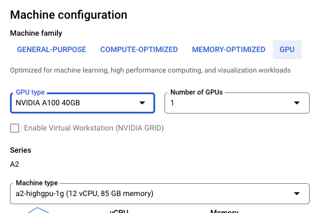
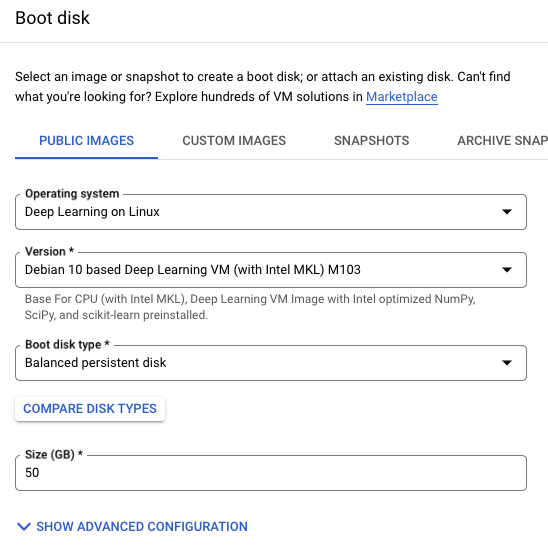
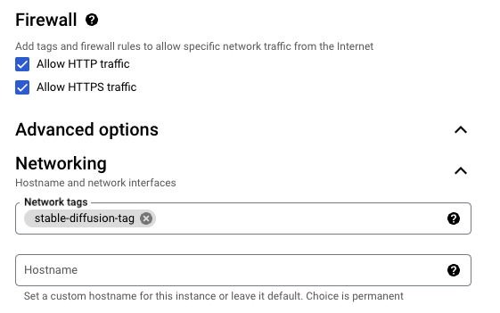
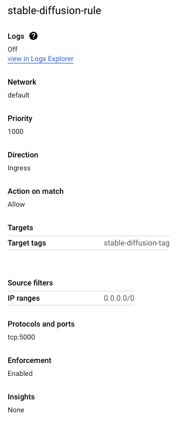

# Deploying and Running Stable Diffusion v2 on Google Cloud Platform (GCP)
This is a reference for deploying Stable Diffusion v2 to GCP. It makes use of the following:

- Cog: https://github.com/replicate/cog (which is essentially a wrapper over docker for generating container images from ML models)
- Stable Diffusion v2: There are many forks but I stuck with the base one for this https://github.com/replicate/cog-stable-diffusion
- [Huggingface.co](https://huggingface.co/): This is like the Github for AI/ ML and has a ton of models as well as data sets for training and inference.

Before we get into the details, here's what this will let you do :)


https://user-images.githubusercontent.com/19495789/222873641-856ba583-d0f2-4f17-8dec-f00208cc7e3b.mp4


## Prerequisites

1. Access to a GCP account and GPU instances (may need to request this manually if they are not available by default)
2. SSH configured so you can access your Google VM from the command line
3. [Huggingface](https://huggingface.co/) account with [User Access Token](https://huggingface.co/settings/tokens) created. We will get weights for running inference from here.


## Steps

Here is the summary:

1. Set up your GCP (GPU enabled) VM Instance
2. Install required GPU software on the VM
3. Download & setup Cog, Stable diffusion & huggingface weights
4. Run predictions!

### Setting up your GCP VM Instance

#### Machine Type
This is what I used:
   <p align="center">
    
   </p>

Note: 
 - I tried using a cheaper T4 instance first but ran out of memory when trying to run the model. 

  ```
    File "/root/.pyenv/versions/3.10.10/lib/python3.10/site-packages/diffusers/models/attention.py", line 654, 
    in _attention attention_scores = torch.baddbmm(torch.cuda.OutOfMemoryError: CUDA out of memory. 
    
    Tried to allocate 3.16 GiB (GPU 0; 14.75 GiB total capacity; 
    9.37 GiB already allocated; 1.14 GiB free; 12.58 GiB reserved in total by PyTorch) 

  ```

 - I thought of trying the [V100](https://www.nvidia.com/en-us/data-center/v100/) next but then I checked and it seems like GCP [only carries the 16GB option](https://cloud.google.com/blog/products/gcp/expanding-our-gpu-portfolio-with-nvidia-tesla-v100), which would have likely resulted in the same OOM issue.

#### Boot Image

I wanted something that ideally had CUDA and Nvidia toolkit installed but the closest I found was this (all others were configured for Tensor Flow)

<p align="center">
  
</p>

#### Networking
I did 2 things (these are only important if you want to be able to enable API access externally - which I planned to do):
1. Enabled HTTP and HTTPS traffic
<p align="center">
  
</p>
2. Setup a firewall rule to allow all external IPs and opened tcp port 5000
<p align="center">
  
</p>


### Installing GPU Software

I realized that the VM did not come preinstalled with [Nvidia CUDA toolkit](https://developer.nvidia.com/cuda-downloads) and [Nvidia container toolkit](https://docs.nvidia.com/datacenter/cloud-native/container-toolkit/overview.html), which are required for cog to be able to run a container on this VM. I set these up using a couple references from Nvidia documentation:

- [Nvidia CUDA toolkit installation docs](https://docs.nvidia.com/cuda/archive/10.1/cuda-installation-guide-linux/index.html#about-this-document)
- [Nvidia Container Toolkit installation docs](https://docs.nvidia.com/datacenter/cloud-native/container-toolkit/install-guide.html#docker)

Here is the CLI reference:

1. You can perform some pre-checks of your HW, OS and packages first:
   ```console
    # verify you have a CIDA-capable GPU (check against http://developer.nvidia.com/cuda-gpus)
    $ lspci | grep -i nvidia
    00:04.0 3D controller: NVIDIA Corporation TU104GL [Tesla T4] (rev a1)

    # verify you are running a supported version of Linux
    $ uname -m && cat /etc/*release
    x86_64
    PRETTY_NAME="Debian GNU/Linux 10 (buster)"
    NAME="Debian GNU/Linux"
    VERSION_ID="10"
    VERSION="10 (buster)"
    VERSION_CODENAME=buster
    ID=debian
    HOME_URL="https://www.debian.org/"
    SUPPORT_URL="https://www.debian.org/support"
    BUG_REPORT_URL="https://bugs.debian.org/"
    
    # verify your VM image has gcc installed
    $ gcc --version
    gcc (Debian 8.3.0-6) 8.3.0
    Copyright (C) 2018 Free Software Foundation, Inc.
    This is free software; see the source for copying conditions.  There is NO
    warranty; not even for MERCHANTABILITY or FITNESS FOR A PARTICULAR PURPOSE.

    # check/ update kernel headers & development packages
    $ uname -r
    4.19.0-22-cloud-amd64
    
    $ sudo apt-get install linux-headers-$(uname -r)
    Reading package lists... Done
    Building dependency tree       
    Reading state information... Done
    linux-headers-4.19.0-22-cloud-amd64 is already the newest version (4.19.260-1).
    0 upgraded, 0 newly installed, 0 to remove and 25 not upgraded.

   ```
2. Install CUDA toolkit
   ```
   $ wget https://developer.download.nvidia.com/compute/cuda/12.1.0/local_installers/cuda-repo-debian10-12-1-local_12.1.0-530.30.02-1_amd64.deb
   
   $ sudo dpkg -i cuda-repo-debian10-12-1-local_12.1.0-530.30.02-1_amd64.deb
   
   $ sudo cp /var/cuda-repo-debian10-12-1-local/cuda-*-keyring.gpg /usr/share/keyrings/

   $ sudo add-apt-repository contrib

   $ sudo apt-get update

   $ sudo apt-get -y install cuda
   ```
3. Install Nvidia Container Toolkit
   ```
   $ distribution=$(. /etc/os-release;echo $ID$VERSION_ID) \
      && curl -fsSL https://nvidia.github.io/libnvidia-container/gpgkey | sudo gpg --dearmor -o /usr/share/keyrings/nvidia-container-toolkit-keyring.gpg \
      && curl -s -L https://nvidia.github.io/libnvidia-container/$distribution/libnvidia-container.list | \
            sed 's#deb https://#deb [signed-by=/usr/share/keyrings/nvidia-container-toolkit-keyring.gpg] https://#g' | \
            sudo tee /etc/apt/sources.list.d/nvidia-container-toolkit.list

   $ sudo apt-get update

   $ sudo apt-get install -y nvidia-container-toolkit

   $ sudo nvidia-ctk runtime configure --runtime=docker

   $ sudo systemctl restart docker
   ```
4. Verify by testing running a base CUDA container from https://hub.docker.com/r/nvidia/cuda
   
   ```
   $ sudo docker run --rm --runtime=nvidia --gpus all nvidia/cuda:11.6.2-base-ubuntu20.04 nvidia-smi

   Sat Mar  4 03:08:45 2023       
    +---------------------------------------------------------------------------------------+
    | NVIDIA-SMI 530.30.02              Driver Version: 530.30.02    CUDA Version: 12.1     |
    |-----------------------------------------+----------------------+----------------------+
    | GPU  Name                  Persistence-M| Bus-Id        Disp.A | Volatile Uncorr. ECC |
    | Fan  Temp  Perf            Pwr:Usage/Cap|         Memory-Usage | GPU-Util  Compute M. |
    |                                         |                      |               MIG M. |
    |=========================================+======================+======================|
    |   0  NVIDIA A100-SXM4-40GB           On | 00000000:00:04.0 Off |                    0 |
    | N/A   31C    P0               44W / 400W|      0MiB / 40960MiB |      0%      Default |
    |                                         |                      |             Disabled |
    +-----------------------------------------+----------------------+----------------------+
                                                                                            
    +---------------------------------------------------------------------------------------+
    | Processes:                                                                            |
    |  GPU   GI   CI        PID   Type   Process name                            GPU Memory |
    |        ID   ID                                                             Usage      |
    |=======================================================================================|
    |  No running processes found                                                           |
    +---------------------------------------------------------------------------------------+


   ```

### Setting up Cog, Stable Diffusion & Huggingface weights

1. Clone the Cog & Stable Diffusion repos on the VM
   ```
   $ git clone https://github.com/replicate/cog

   $ git clone https://github.com/replicate/cog-stable-diffusion
   
2. Install Cog
3. ```
    $ sudo curl -o /usr/local/bin/cog -L https://github.com/replicate/cog/releases/latest/download/cog_`uname -s`_`uname -m`
   ```
4.  Build Stable Diffusion docker image using Cog
    ```
    $ cd cog-stable-diffusion/

    $ cog build
    ```
5.  Download weights for the model from huggingface (replace with your [huggingface user auth token](https://huggingface.co/settings/tokens))
    ```
    $ cog run script/download-weights <huggingface-auth-token from https://huggingface.co/settings/tokens>
    ```
6.  Run predictions!
    ```
    anilmurty@sd-instance-3:~/cog-stable-diffusion$ cog predict -i prompt="portland oregon on mars"
    Building Docker image from environment in cog.yaml...
    [+] Building 0.7s (18/18) FINISHED                                                                                                                                                                    
    => [internal] load build definition from Dockerfile                                                                                                                                             0.0s
    => => transferring dockerfile: 2.01kB                                                                                                                                                           0.0s
    => [internal] load .dockerignore                                                                                                                                                                0.0s
    => => transferring context: 34B                                                                                                                                                                 0.0s
    => resolve image config for docker.io/docker/dockerfile:1.2                                                                                                                                     0.2s
    => CACHED docker-image://docker.io/docker/dockerfile:1.2@sha256:e2a8561e419ab1ba6b2fe6cbdf49fd92b95912df1cf7d313c3e2230a333fdbcc                                                                0.0s
    => [internal] load metadata for docker.io/nvidia/cuda:11.6.0-cudnn8-devel-ubuntu20.04                                                                                                           0.1s
    => [internal] load build context                                                                                                                                                                0.0s
    => => transferring context: 40.60kB                                                                                                                                                             0.0s
    => [stage-0  1/10] FROM docker.io/nvidia/cuda:11.6.0-cudnn8-devel-ubuntu20.04@sha256:6a4ef3d0032001ab91e0e6ecc27ebf59dd122a531703de8f64cc8486c50b570a                                           0.0s
    => CACHED [stage-0  2/10] RUN rm -f /etc/apt/sources.list.d/cuda.list &&     rm -f /etc/apt/sources.list.d/nvidia-ml.list &&     apt-key del 7fa2af80                                           0.0s
    => CACHED [stage-0  3/10] RUN --mount=type=cache,target=/var/cache/apt set -eux; apt-get update -qq; apt-get install -qqy --no-install-recommends curl; rm -rf /var/lib/apt/lists/*; TINI_VERS  0.0s
    => CACHED [stage-0  4/10] RUN --mount=type=cache,target=/var/cache/apt apt-get update -qq && apt-get install -qqy --no-install-recommends  make  build-essential  libssl-dev  zlib1g-dev  libb  0.0s
    => CACHED [stage-0  5/10] RUN curl -s -S -L https://raw.githubusercontent.com/pyenv/pyenv-installer/master/bin/pyenv-installer | bash &&  git clone https://github.com/momo-lab/pyenv-install-  0.0s
    => CACHED [stage-0  6/10] COPY .cog/tmp/build831441710/cog-0.0.1.dev-py3-none-any.whl /tmp/cog-0.0.1.dev-py3-none-any.whl                                                                       0.0s
    => CACHED [stage-0  7/10] RUN --mount=type=cache,target=/root/.cache/pip pip install /tmp/cog-0.0.1.dev-py3-none-any.whl                                                                        0.0s
    => CACHED [stage-0  8/10] COPY .cog/tmp/build831441710/requirements.txt /tmp/requirements.txt                                                                                                   0.0s
    => CACHED [stage-0  9/10] RUN --mount=type=cache,target=/root/.cache/pip pip install -r /tmp/requirements.txt                                                                                   0.0s
    => CACHED [stage-0 10/10] WORKDIR /src                                                                                                                                                          0.0s
    => exporting to image                                                                                                                                                                           0.0s
    => => exporting layers                                                                                                                                                                          0.0s
    => => writing image sha256:58301af8bc9b4483f2266da037473fc2413cede96b5f63481ce6da7bad847835                                                                                                     0.0s
    => => naming to docker.io/library/cog-cog-stable-diffusion-base                                                                                                                                 0.0s
    => exporting cache                                                                                                                                                                              0.0s
    => => preparing build cache for export                                                                                                                                                          0.0s


    Starting Docker image cog-cog-stable-diffusion-base and running setup()...
    Loading pipeline...
    Running prediction...
    Using seed: 49692
    0%|          | 0/50 [00:00<?, ?it/s]
    2%|▏         | 1/50 [00:01<01:02,  1.27s/it]
    4%|▍         | 2/50 [00:01<00:32,  1.48it/s]
    6%|▌         | 3/50 [00:01<00:22,  2.06it/s]
    8%|▊         | 4/50 [00:02<00:18,  2.52it/s]
    10%|█         | 5/50 [00:02<00:15,  2.88it/s]
    12%|█▏        | 6/50 [00:02<00:13,  3.15it/s]
    14%|█▍        | 7/50 [00:02<00:12,  3.34it/s]
    16%|█▌        | 8/50 [00:03<00:12,  3.49it/s]
    18%|█▊        | 9/50 [00:03<00:11,  3.59it/s]
    20%|██        | 10/50 [00:03<00:10,  3.66it/s]
    22%|██▏       | 11/50 [00:03<00:10,  3.71it/s]
    24%|██▍       | 12/50 [00:04<00:10,  3.75it/s]
    26%|██▌       | 13/50 [00:04<00:09,  3.78it/s]
    28%|██▊       | 14/50 [00:04<00:09,  3.80it/s]
    30%|███       | 15/50 [00:04<00:09,  3.81it/s]
    32%|███▏      | 16/50 [00:05<00:08,  3.82it/s]
    34%|███▍      | 17/50 [00:05<00:08,  3.83it/s]
    36%|███▌      | 18/50 [00:05<00:08,  3.83it/s]
    38%|███▊      | 19/50 [00:05<00:08,  3.84it/s]
    40%|████      | 20/50 [00:06<00:07,  3.84it/s]
    42%|████▏     | 21/50 [00:06<00:07,  3.84it/s]
    44%|████▍     | 22/50 [00:06<00:07,  3.85it/s]
    46%|████▌     | 23/50 [00:06<00:07,  3.85it/s]
    48%|████▊     | 24/50 [00:07<00:06,  3.85it/s]
    50%|█████     | 25/50 [00:07<00:06,  3.85it/s]
    52%|█████▏    | 26/50 [00:07<00:06,  3.85it/s]
    54%|█████▍    | 27/50 [00:08<00:05,  3.85it/s]
    56%|█████▌    | 28/50 [00:08<00:05,  3.85it/s]
    58%|█████▊    | 29/50 [00:08<00:05,  3.85it/s]
    60%|██████    | 30/50 [00:08<00:05,  3.85it/s]
    62%|██████▏   | 31/50 [00:09<00:04,  3.85it/s]
    64%|██████▍   | 32/50 [00:09<00:04,  3.85it/s]
    66%|██████▌   | 33/50 [00:09<00:04,  3.85it/s]
    68%|██████▊   | 34/50 [00:09<00:04,  3.85it/s]
    70%|███████   | 35/50 [00:10<00:03,  3.85it/s]
    72%|███████▏  | 36/50 [00:10<00:03,  3.85it/s]
    74%|███████▍  | 37/50 [00:10<00:03,  3.85it/s]
    76%|███████▌  | 38/50 [00:10<00:03,  3.85it/s]
    78%|███████▊  | 39/50 [00:11<00:02,  3.85it/s]
    80%|████████  | 40/50 [00:11<00:02,  3.85it/s]
    82%|████████▏ | 41/50 [00:11<00:02,  3.85it/s]
    84%|████████▍ | 42/50 [00:11<00:02,  3.85it/s]
    86%|████████▌ | 43/50 [00:12<00:01,  3.86it/s]
    88%|████████▊ | 44/50 [00:12<00:01,  3.86it/s]
    90%|█████████ | 45/50 [00:12<00:01,  3.86it/s]
    92%|█████████▏| 46/50 [00:12<00:01,  3.86it/s]
    94%|█████████▍| 47/50 [00:13<00:00,  3.86it/s]
    96%|█████████▌| 48/50 [00:13<00:00,  3.86it/s]
    98%|█████████▊| 49/50 [00:13<00:00,  3.85it/s]
    100%|██████████| 50/50 [00:13<00:00,  3.86it/s]
    100%|██████████| 50/50 [00:14<00:00,  3.57it/s]
    Written output to output.0.png
    /root/.pyenv/versions/3.10.10/lib/python3.10/multiprocessing/resource_tracker.py:224: UserWarning: resource_tracker: There appear to be 1 leaked semaphore objects to clean up at shutdown
    warnings.warn('resource_tracker: There appear to be %d '
    ```

    Note that the output image is located in the same directory in a file called "output.0.png"
     
    ```
    anilmurty@sd-instance-3:~/cog-stable-diffusion$ ls
    LICENSE  README.md  __pycache__  cog.yaml  diffusers-cache  output.0.png  predict.py  script

    ```

    To view it, you can either SCP it out of your GCP instance or do what I did and use the [VSCode extension](https://code.visualstudio.com/docs/remote/ssh) to connect to the remote host and view the file (see video at the top)
